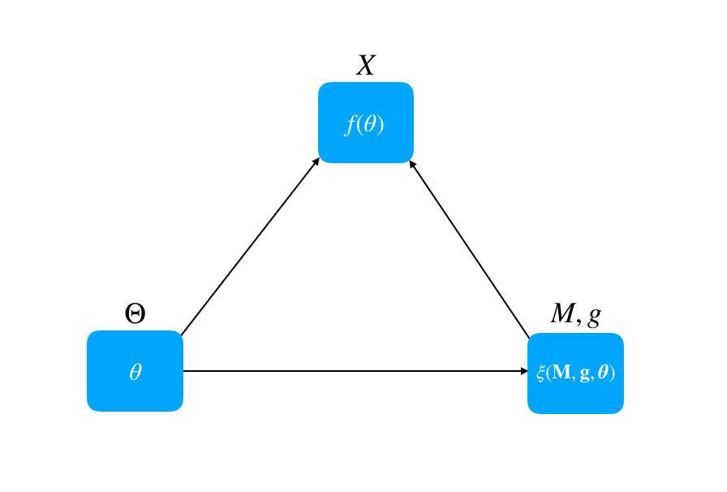

#                    Haihan Yu

I am a researcher at [Multi-Agent Laboratory](https://bit.ly/2FBENYL) of [Graduate School of Information Science and Electrical Engineering](http://www.isee.kyushu-u.ac.jp/e/), [Kyushu University](http://www.kyushu-u.ac.jp/en/).  

My research interests are game theory, market design and behavioral economics.  

<strong>Contact Information: </strong> 
Room 825, West 2 bldg. 
Kyushu University 
Motooka 744, Nishi-Ku 
Fukuoka, Japan 
Email:haihanyu(at)inf.kyushu-u.ac.jp

